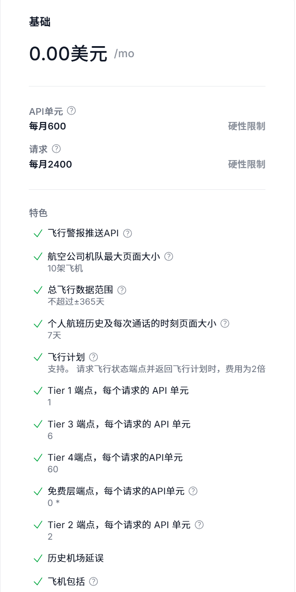

# 前端地图与地理可视化 (Vue 侧)

## OpenSky Network(实时位置接口)

    - 注册后免费，频率限制较宽松。
    - 能够获取实时状态、位置更新、历史轨迹。
    - 链接：https://github.com/openskynetwork/opensky-api

## AeroDataBox(航班详情与搜索接口)

    - 每月约 600 次免费调用(通过rapidapi)
    - 获取航班延误统计、航站楼/登机口、机型参数。
    - 链接：https://aerodatabox.com/
    - 

## Aviationstack

    - 免费的每月100次调用
    - 获取实时航班查询、历史记录、航线信息。
    - 链接：https://github.com/apilayer/aviationstack

## Mapbox(地图底图接口)

    - 用于网页上交互式、可自定义矢量地图的 JavaScript 库
    - 链接：https://github.com/mapbox/mapbox-gl-js
    - 当前状态：由于IP限制导致无法完成账号注册，暂不采用并移出接口测试清单。

## Leaflet(地图底图接口)

    - 用于构建强大的交互式地图，注重简洁、性能和可用性。
    - 链接：https://github.com/Leaflet/Leaflet

## CesiumJS(地图底图接口)

    - 用于创建 3D 地球和地图的 JavaScript 库，用于后续的三维可视化开发
    - 链接：https://github.com/CesiumGS/cesium

## AntV L7(地图底图接口)

    - 基于 WebGL 的开源大规模地理空间数据可视分析引擎
    - 链接：https://github.com/antvis/L7

# 后端增强与实时通信 (Python / Qt 侧)

## WebSocket (FastAPI / Flask-SocketIO)：

    - 实现数据的实时推送。
    - 当 Python 后端从 API 拿到新的位置时，立即推给 Vue 前端，避免页面频繁刷新。

## Aiohttp / HTTPX：

    - 异步 HTTP 客户端库，适合在 FastAPI 中使用。
    - 用于定时从第三方 API 获取数据，支持高并发和超时控制。

# 可视化图表 (数据分析)

## ECharts(Vue-ECharts)：

    - 强大的开源可视化库，适合展示统计数据、趋势图等。
    - 可以在 Vue 中集成，展示航班延误统计、速度分布等。
    - 适合做航班延误率的雷达图、不同航司飞行总里程的柱状图等。

## Canvas-Gauges：

    - 用于创建仪表盘风格的图表，适合展示速度、高度等实时数据。
    - 可以在 Vue 中集成，展示航班当前速度、飞行高度等信息。
    - 适合模拟飞机的高度计、速度仪等物理仪表。

# UI与其他素材
## FontAwesome(图标库)
## Iconfont(阿里巴巴矢量图标库)
plane, take-off, landing, globe, location, speedometer, altitude, etc.

## OpenWeatherMap(天气数据接口)

    - 获取航班所在位置的实时天气数据，增强可视化效果。
    - 链接：https://openweathermap.org/

